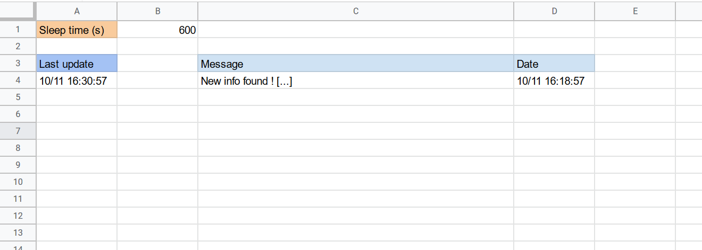

# loopleSheet

**The purpose of this library is to provide a subroutine wrapper connected to a Google Sheet. It implements the main loop (calling the subroutine in a loop) and interacts with a Google Sheet.**

This library allows the rapid deployment of a robot and offers a tracking of it. This can be relevant for example in the context of Raspeberry Pi boards.

A full documentation is available [here](https://antnlocks.github.io/loopleSheet/doc/build/html/index.html).

**Features:**
- sleep time between 2 executions of the subroutine is read from the Google Sheet
- display the date and time of the last execution of the subroutine in the Google Sheet
- allow to post messages in the Google Sheet. These messages are automatically time-stamped


In order to use this library, you need to have a Google account and you need to accept the Terms of use of Google Cloud Platform.

## Installing

You can install this library using:
```shell
pip install loopleSheet
```
or:
```shell
python3 -m pip install loopleSheet
```

## Useful Information

In order to work with a Google Sheet, `loopleSheet` need 2 elements:
- the `key` of the Google Sheet (a.k.a *Spreadsheet ID*)
- a `.json` file with *access credentials*


### Getting a Spreadsheet ID

You can get the Spredsheet ID of a Google Sheet from the url used when you edit the Google Sheet online. It is the part between `https://docs.google.com/spreadsheets/d/` and `/edit#gid=0`.

For example, in the url `https://docs.google.com/spreadsheets/d/1LzDqgfWea1cIafGnXhIc2OEFCHzoFOSdO1qsSlK3rGk/edit#gid=0`, the Spreadsheet ID is *1LzDqgfWea1cIafGnXhIc2OEFCHzoFOSdO1qsSlK3rGk*.


### Creating access credentials

This library uses Google `Service account` credentials. You can follow this [documentation](https://developers.google.com/workspace/guides/create-credentials#service-account) for creating a *Project* and a *Service account*. Don't forget to select Google Sheet API when you are asked which API you want to use.

At the end of the process, you should have downloaded the `.json` file.


### Authorizing the Service account to edit the Google Sheet

If you haven't shared your Google Sheet, it can only be edited by you (the Google account that created the Google Sheet). So, in order for the Service account to edit the Google Sheet, you must share it with them.

The Service account has an email address. You can find it in your Google Cloud Console or more easily in the `.json` (tag `"client_email"`). Just share the Google Sheet with this specific email address or with anyone if you're fine with it. Don't forget to allow modifications.


## Google Sheet template

Your Google Sheet is not processed by `loopleSheet`, so don't expect some clever behaviour.
I suggest your Google Sheet to be like this one :



By default, `loopleSheet`:
- expects in the `B1` cell the number of seconds to sleep between 2 executions 
- will write the date and time of the last performed execution in the `A4` cell
- will write the messages you want to post in the `C` column with the associated date and time in the `D` column
- works on the `first` sheet of the Google Sheet

You can edit this behavior.


## Examples

```python
import os
import sys
import loopleSheet

def subroutine(loopleSht):
	# Doing some work...

	if special_result:
		loopleSht.post('New info found ! [...]')


# The .json is next to the script
LoopleSheet(json_path=os.path.dirname(os.path.realpath(sys.argv[0]))+'/credentials.json',
spreadsheet_id='1LzDqgfWea1cIafGnXhIc2OEFCHzoFOSdO1qsSlK3rGk',
runnable=subroutine,
catchingExceptionsFromRunnable=True).start()
```

Note: You may have to kill the script in order to finish it
